# Lab 04: M365 Suspicious Sign-ins — Portal Triage + KQL Investigation Patterns

## Recruiter-Friendly Summary

In this lab I investigated suspicious Microsoft 365 (M365) sign-in activity using a SOC-style workflow: portal triage first, containment when needed, then structured hunting with KQL (Kusto Query Language).
I validated how to capture the right pivots (user, IP, auth details), revoke sessions, enforce stronger authentication, and confirm remediation by forcing reauthentication.
Because this environment used Azure Monitor Logs demo data (no `SigninLogs` or `AuditLogs` tables), I treated `AppRequests` as proxy telemetry to practice the same investigation pattern: inventory data sources, scope time, summarize anomalies, and compare recent behavior to baseline.
The focus is not "running queries," it is proving a repeatable investigation method with evidence artifacts that are easy to explain in interviews.

## Evidence

- Sign-in log screenshots show portal triage plus containment and remediation validation.
- KQL screenshots show the investigation pattern: table inventory, schema sanity check, time scoping, summarization, and baseline comparison.

## Why it matters

In a real SOC, most time is lost on "where do I start" and "what do I check next." This lab demonstrates a repeatable, evidence-driven investigation pattern that begins in the portal for fast context, applies containment when appropriate, then pivots into KQL for structured hunting and summarization.

## Objectives

1. Use Entra Sign-in logs for quick portal-based triage: user, IP, authentication details, and risk signals.
2. Apply containment steps and validate remediation worked (forced reauthentication).
3. Use a repeatable KQL pattern: inventory tables → confirm schema → time scope → project fields → summarize → baseline vs recent.
4. Document evidence (screenshots + queries) so the workflow is interview-ready and reproducible.

## Lab environment

1. Microsoft Entra admin center: Sign-in logs, portal-based triage and remediation.
2. Azure Monitor Logs: demo workspace, KQL against available demo tables.
3. Data caveat: this demo workspace does not contain `SigninLogs` or `AuditLogs`, so the KQL portion uses `AppRequests` as a stand-in to practice the workflow and anomaly hunting pattern.

## Repeatable workflow

1. Portal triage: isolate the event, capture pivots (user, IP, result, MFA/Conditional Access outcomes).
2. Decide next step: user friction vs risk that requires containment.
3. Contain: revoke sessions and enforce stronger authentication.
4. Validate: confirm reauthentication occurred.
5. Pivot to KQL: confirm what tables exist and what fields are populated.
6. Hunt with structure: time scope → project fields → summarize → baseline vs recent → decide follow-up actions.

---

## 1. Portal triage: start with the sign-in record

I start in the portal because it gives me the fastest context (user, IP, result, authentication details). That helps me decide next steps before I touch KQL.

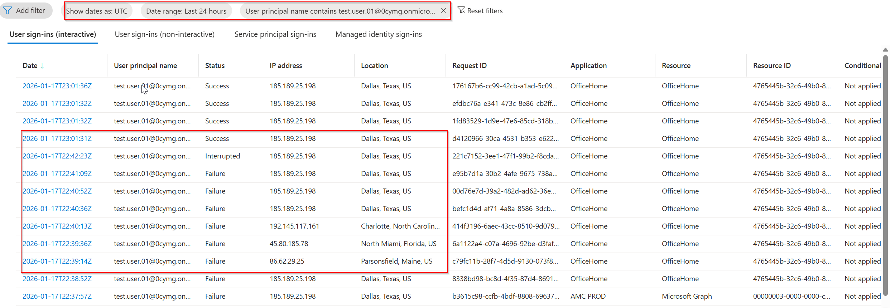

I filtered the sign-in logs to isolate the event I cared about, and I verified I was looking at the right user and timeframe.

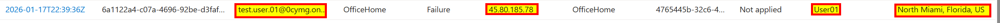

From the event details I captured the basics: result, IP, user agent, and any location/device hints. These become pivots later.

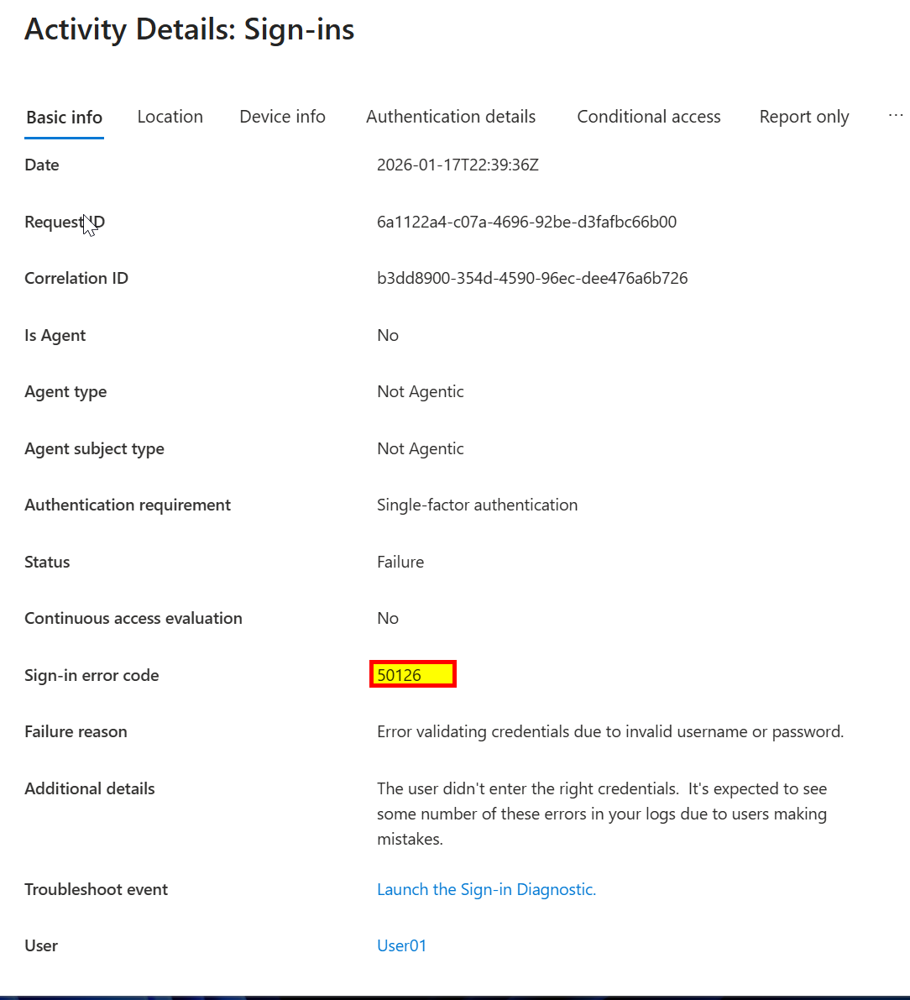

I scroll through the details to find the parts that answer: was this expected, what method was used, and what changed compared to normal behavior.

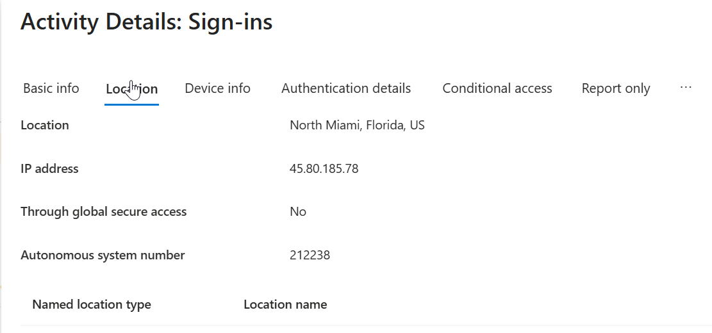

If something looks off, I focus on what I can validate quickly: sign-in risk signals, Conditional Access outcomes, and whether MFA was present.

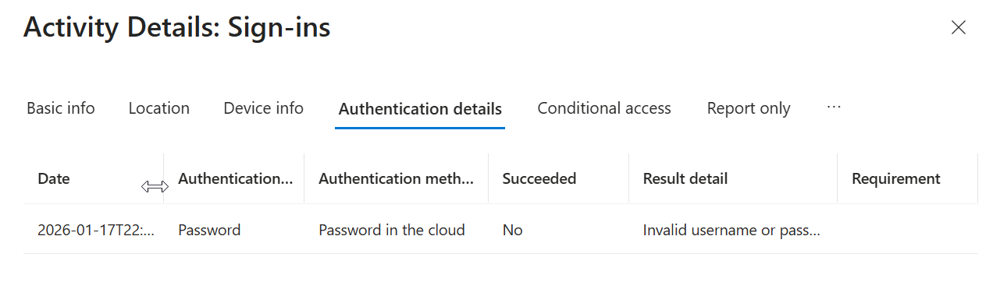

At this point I’m deciding whether to treat it as user friction or an actual risk. If I can’t explain it fast, I move to containment.

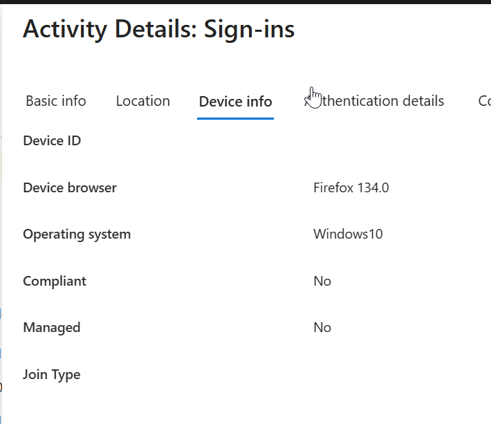

Before doing anything heavy, I document what I saw so I can explain it clearly in an interview.

---

## 2. Containment: force a clean session and stronger auth

These are the same actions I would take in real triage if I suspect an account was used in a way the user did not intend.

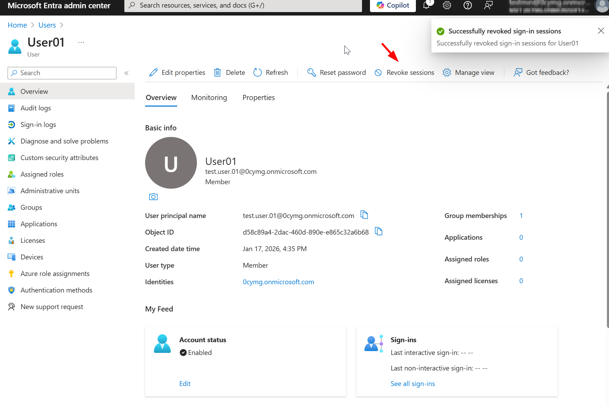

I revoked sessions to invalidate existing tokens. The goal is to stop any active session without waiting for token expiry.

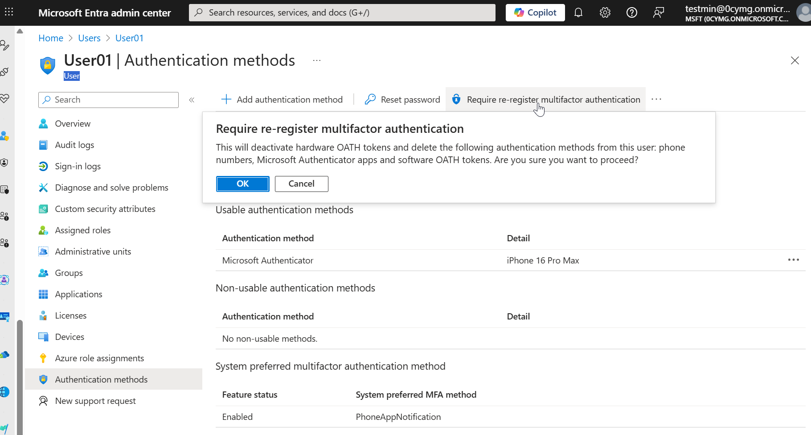

I enforced stronger authentication so the next sign-in requires the user to prove they are the legitimate owner of the account.

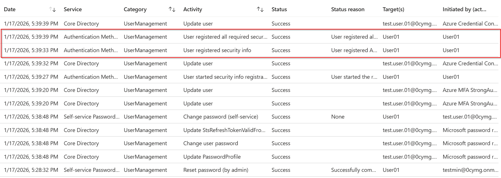

I verified the user was forced to reauthenticate. I don’t assume remediation worked, I want proof.

---

## 3. Pivot to KQL: inventory the workspace first

In a production Sentinel workspace, I would expect tables like `SigninLogs` and `AuditLogs` if Entra logs are ingested. In this demo workspace, I confirmed what tables exist so I don’t waste time writing queries against data that isn’t there.

```kql
search *
| summarize Count=count() by $table
| top 25 by Count desc
```

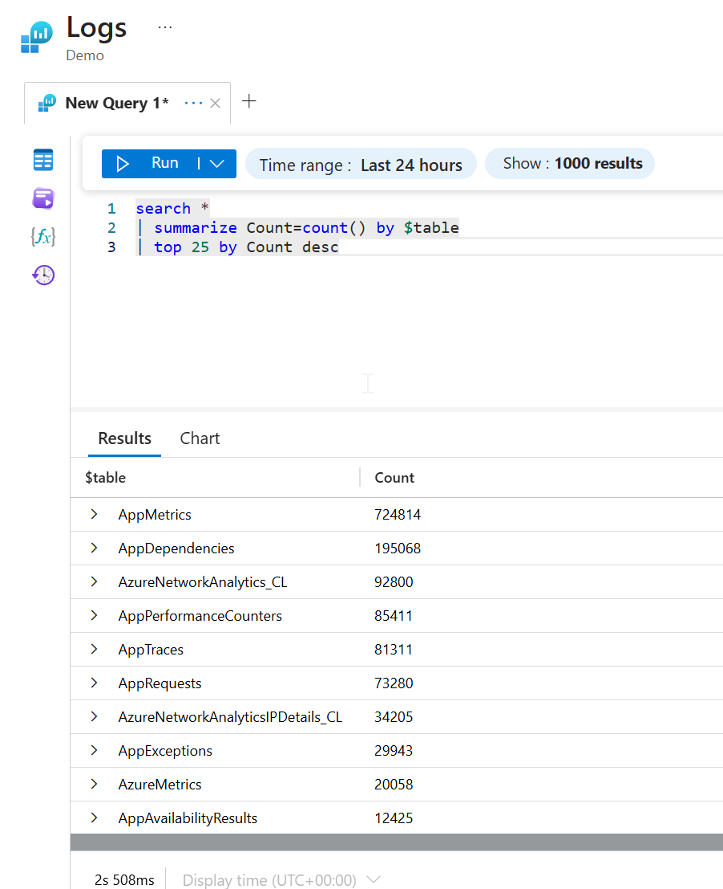

I always start with table inventory. It tells me what I can realistically investigate.

---

## 4. Pull a small sample first (schema sanity check)

Before summarizing anything, I pull a small sample so I can see the schema and confirm which fields are populated.

```kql
AppRequests
| take 25
```

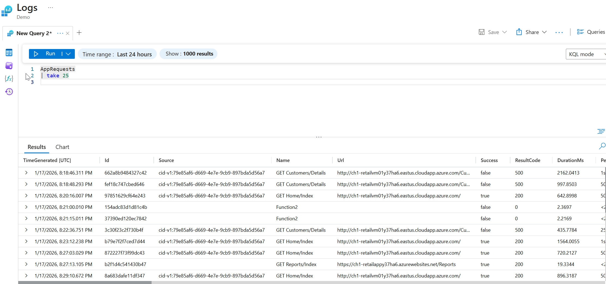

If I don’t know what columns I have, I can’t write a clean query.

---

## 5. Time scope and project only useful fields

Once I know the table and fields, I narrow the time window and keep only columns that support fast triage.

```kql
AppRequests
| where TimeGenerated > ago(24h)
| project TimeGenerated, Name, ResultCode, DurationMs, Success
| order by TimeGenerated desc
```

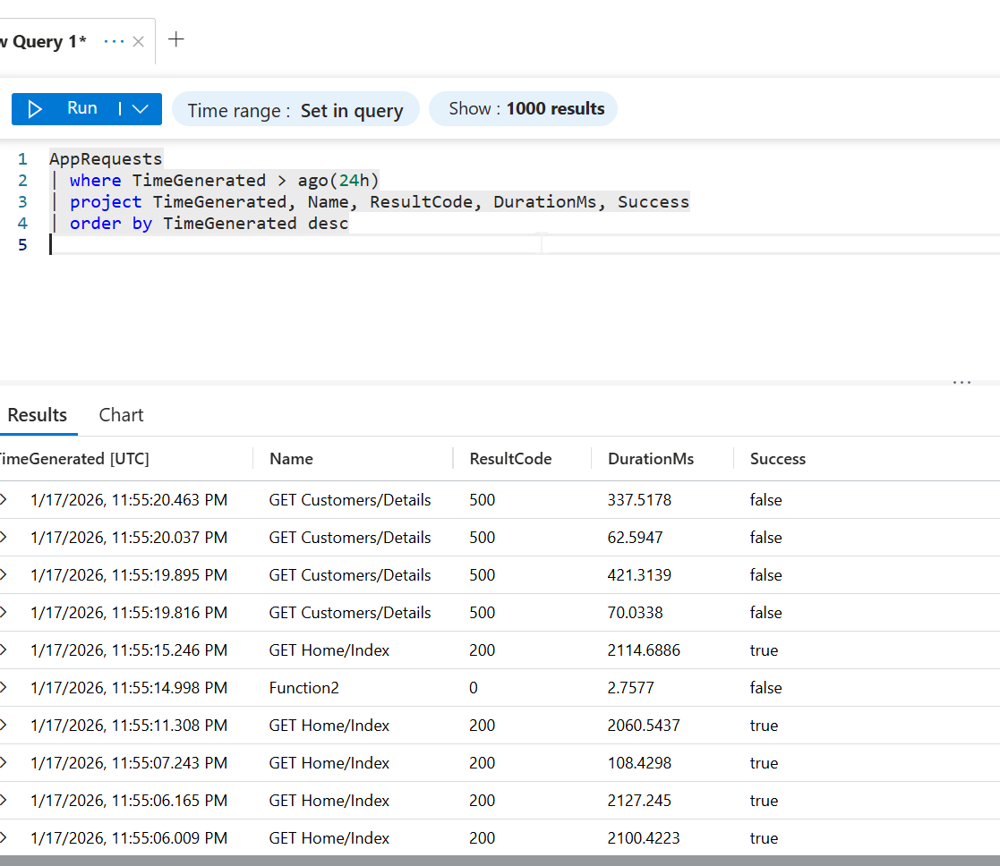

This mirrors my sign-in investigation approach: narrow the window, select fields that matter, sort newest first.

---

## 6. Summarize and threshold to find spikes

Raw rows are noisy. Summarizing makes patterns obvious, then a simple threshold helps prioritize.

```kql
AppRequests
| where TimeGenerated > ago(7d)
| summarize RequestCount=count(), Failures=countif(Success == false) by Name, bin(TimeGenerated, 1h)
| where Failures > 2
| order by TimeGenerated desc
```

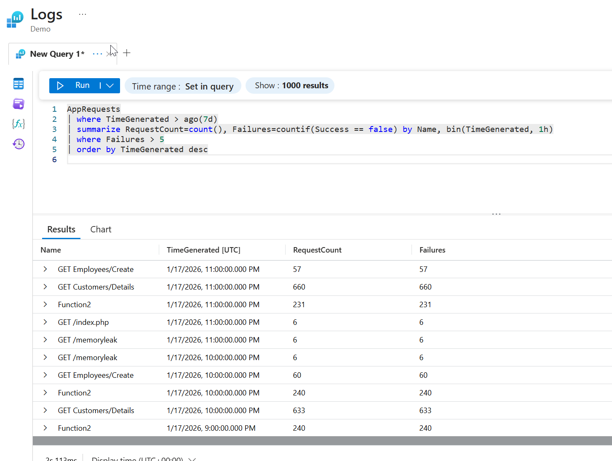

This is a triage filter. It doesn’t declare "safe vs unsafe," it helps focus investigation time.

---

## 7. Baseline vs recent: find new behavior

This is the pattern I use often: build a baseline list from an earlier window, compare it to the most recent window, and identify what’s new.

```kql
let baselineNames =
    AppRequests
    | where TimeGenerated between (ago(8d) .. ago(1d))
    | distinct Name;
AppRequests
| where TimeGenerated > ago(1d)
| where Name !in (baselineNames)
| summarize Events=count(), SampleResultCodes=make_set(ResultCode, 10) by Name
| order by Events desc
```

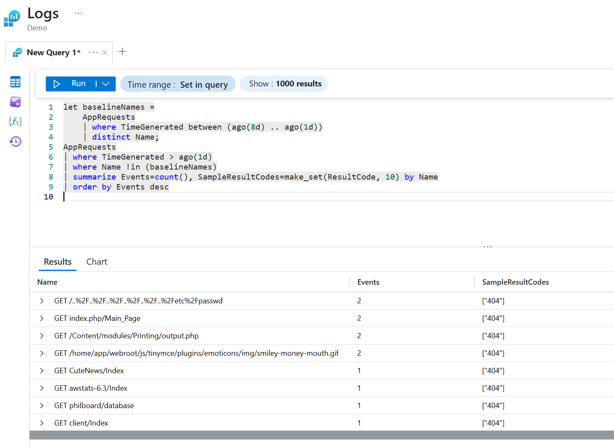

In my results, the "new names" resembled automated probing for common files and paths (many 404s, some 500s). This is not a confirmed compromise, but it is the kind of signal I would validate with app owners, WAF logs, and correlated IP activity.

---

## Findings

1. Repeated failures (especially 500s) are worth validating because they can indicate misconfiguration, error handling bugs, or traffic causing instability.
2. New paths returning 404s, especially common web app targets, often align with automated scanning and reconnaissance.
3. Even with demo data, the workflow is the point: confirm data → sample schema → time scope → summarize → baseline vs recent → decide next actions.

---

## Production-ready queries (what I would run if Entra logs were ingested)

If I had full log ingestion (Microsoft Sentinel / Log Analytics with Entra integration), I would run the same workflow against the correct tables like `SigninLogs` and `AuditLogs`.

### A) Failed sign-ins by user and IP (quick triage)
```kql
SigninLogs
| where TimeGenerated > ago(24h)
| where ResultType != 0
| summarize Failures=count() by UserPrincipalName, IPAddress, AppDisplayName, bin(TimeGenerated, 1h)
| order by Failures desc
```

### B) Password spray signal (many users from one IP)
```kql
SigninLogs
| where TimeGenerated > ago(24h)
| where ResultType != 0
| summarize DistinctUsers=dcount(UserPrincipalName), Failures=count() by IPAddress
| where DistinctUsers >= 10 and Failures >= 20
| order by DistinctUsers desc, Failures desc
```

### C) Fail to success pivot (possible compromised credentials)
```kql
let window = 24h;
let failures =
    SigninLogs
    | where TimeGenerated > ago(window)
    | where ResultType != 0
    | project UserPrincipalName, IPAddress, FailureTime=TimeGenerated;
let successes =
    SigninLogs
    | where TimeGenerated > ago(window)
    | where ResultType == 0
    | project UserPrincipalName, IPAddress, SuccessTime=TimeGenerated;
failures
| join kind=inner successes on UserPrincipalName, IPAddress
| where SuccessTime between (FailureTime .. FailureTime + 2h)
| project UserPrincipalName, IPAddress, FailureTime, SuccessTime
| order by SuccessTime desc
```

### D) MFA and Conditional Access pivots (who signed in without strong auth)
```kql
SigninLogs
| where TimeGenerated > ago(24h)
| project TimeGenerated, UserPrincipalName, IPAddress, AppDisplayName, ResultType, ConditionalAccessStatus, AuthenticationRequirement
| order by TimeGenerated desc
```

---

## Evidence highlights

- Portal triage workflow captured end-to-end:
  - `00_portal_signin_filters.png`
  - `02_portal_signin_event_details.png` through `06_portal_signin_event_details_cont.png`
- Containment + validation proof:
  - `07_revoke_session.png`
  - `08_mfa_remediation_a.png`
  - `12_confirm_reauth.png`
- KQL workflow proof (inventory → sample → scope → summarize → baseline):
  - `13_kql_environment_tables.png`
  - `14_kql_sample_rows_apprequests.png`
  - `15_kql_time_filter_project.png`
  - `16_kql_summary_threshold.png`
  - `17_kql_baseline_new_behavior.png`

---

## MITRE ATT&CK mapping (contextual, evidence-based)

The KQL portion uses `AppRequests` demo telemetry as a proxy, so this mapping reflects the *pattern observed* (web probing and scanning), not a confirmed intrusion.

- **T1595, Active Scanning**: repeated requests for common paths and files (high volume of 404s) are consistent with automated discovery and probing.
- **T1190, Exploit Public-Facing Application**: listed as a hypothesis only. Scanning does not equal exploitation. Confirming T1190 would require additional evidence such as successful code execution, suspicious payloads, or correlated indicators across other logs.

---

## Repo notes

1. The screenshots folder is part of the evidence trail for this lab.
2. Queries are included inline so the workflow is reproducible and easy to review.
